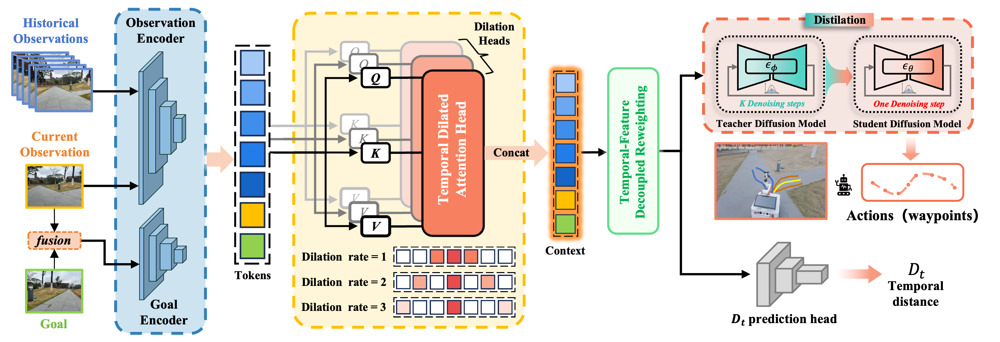
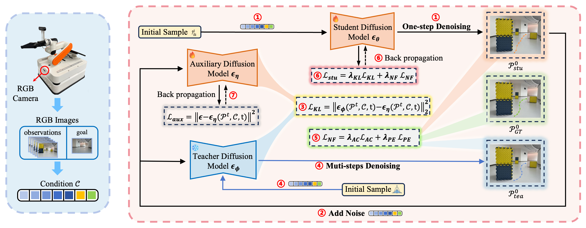

# FastNav：An Efficient and Relible Visual Navigation Approach via Diffusion Distillation

**Overview:** FastNav is an efficient vision-conditioned diffusion framework for RGB-only image-goal navigation. It performs navigation by generating future motion trajectories. The framework introduces Temporal-Dilated Attention (TDA) and Temporal–Feature Decoupled Reweighting (TFDR) mechanisms to maintain a lightweight architecture while preserving strong scene understanding. Additionally, it employs bidirectional-gradient distillation to compress the denoising process into a single denoising step for real-time generation of high-quality trajectories.  

🔹 Architecture of FastNav: 
<p align="center">
  
</p> 
🔹 Distillation Framework: 
<p align="center">
  
</p> 

## 📌 TODO List

- [ ] Release training and deployment code (comming soon!) 
- [ ] Update experimental demo videos

## 🎥 Experiment Videos


## ⚙️ Environment Setup

1. Clone the repository：  
    ```
    git clone https://github.com/FastNav1/FastNav.git
    ```
2. Set up the conda environment:
    ```
    conda env create -f train/train_environment.yml
    ```
3. Install packages:
    ```
    conda activate fastnav
    pip install -e train/
    git clone git@github.com:real-stanford/diffusion_policy.git
    pip install -e diffusion_policy/
    ```

## 📁 Directory 

## 📦 Data Preparation

### Download public datasets:
- [GoStanford2](https://drive.google.com/drive/folders/1RYseCpbtHEFOsmSX2uqNY_kvSxwZLVP_)
- [RECON](https://sites.google.com/view/recon-robot/dataset) 
- [SCAND](https://www.cs.utexas.edu/~xiao/SCAND/SCAND.html#Links)
- [SACSoN](https://sites.google.com/view/sacson-review/huron-dataset) 

    After downloading the public datasets above, process these datasets using the following steps.

### Process datasets:
1. Process rosbag files with `process_bags.py` or RECON HDF5s with `process_recon.py`： 
    ```
    python train/process_bags.py  # for processing rosbags
    python train/process_recon.py # for processing RECON HDF5s
    ```   

    This will produce a dataset structured as follows:
    ``` 
    ├── <dataset_name>
    │   ├── <name_of_traj1>
    │   │   ├── 0.jpg
    │   │   ├── 1.jpg
    │   │   ├── ...
    │   │   ├── T_1.jpg
    │   │   └── traj_data.pkl
    │   ...
    └── └── <name_of_trajN>
        	├── 0.jpg
        	├── 1.jpg
        	├── ...
            ├── T_N.jpg
            └── traj_data.pkl
    ```
    Each trajectory consists of forward-facing RGB observations and a corresponding `traj_data.pkl` dictionary containing the robot's `position` (and `yaw`) at each observation.

     - `position`: An np.ndarray [T, 2] of the xy-coordinates of the robot at each image observation.
     - `yaw`: An np.ndarray [T,] of the yaws of the robot at each image observation.

  2. After running `data_split.py`, the processed data splits will be organized under `vint_release/train/vint_train/data/data_splits/` with the following structure:
    ``` 
    ├── <dataset_name>
    │   ├── train
    |   |   └── traj_names.txt
    └── └── test
            └── traj_names.txt 
    ```
    
